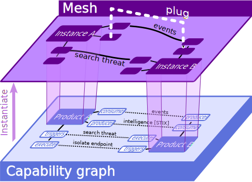

# Concepts

## Integration lifecycle

TODO CYCLE SCHEMA

## Capability graph


Formally, a cybersecurity mesh architecture (CSMA) is a directed graph of products talking to eachother.
More precisely, it is an overlay of 2 graphs:



* The **capability graph**, which expresses the set of all products that can be interoperated with eachother and what functional capacities they expose. Nodes of this graph are Product capabilities, and edges connect complementary capabilities. For example, one product may **consume** alerts **produced** by another product, or can **execute** actions **triggered** by another one. Edges thus characterise interop opportunities about a certain **Topic** between a source product and a destination product. The direction of the edges materializes the dataflow : the source product **produces/triggers** information (resp. actions) that the destination product **consumes/executes**. An edge exists as soon as the products define a compatible producer (or trigger) / consumer (resp. executor) pair of **Integrations**. The edge also carries the **roles** in the data exchange

    * in **push** mode, the producer is **active** and the consumer is **passive** (*e.g.* a Syslog forwarder)
    * in **pull** mode, the producer is **passive** and the consumer is **active** (*e.g.* an HTTP GET API)

Therefore, an edge exists between product couples that expose complementary integrations for compatible topics, and match formats (or other compatibility criteria you want to refine within the scope of a capability).

The density if the capability graph measures the "openness" of the products constellation ; one wants to maximize the number of allowed interops between cybersecurity solutions available on the market

* The **Mesh** graph itself, which means several product **Instances** connected to eachother by **Plugs** which leverage compatible Integrations over the underlying capability graph. Instances correspond to actual user **tenants** of the underlying products, and plugs are live connections between those tenants. In order to setup the defined plugs, instances must be configured to enable the corresponding production/consumption triggering/execution logic, potentially via custom additions to the products themselves. Meshroom's spirit is to make all this configuration and provisioning as simple as a single `meshroom up` command.

To do so, Products, Integrations, Instances and Plugs are defined via YAML manifests and vendor code additions when required. All these files belong to a **git-backed repository** that can be shared, versioned via git and manipulated via the Meshroom CLI (similar with Helm charts being shared among a community of Kubernetes users).

Sensitive data, like API keys and other secrets used to teleoperate the Instances is natively managed by Meshroom in a **local GPG secrets store**. This store can also be shared, like any other GPG content, with GPG peers. This fosters the **sharing** of a SOC-as-code and limits the risk of information leakage.

## Project

A Meshroom Project is a git-backed local directory on your computer, based on a file structure. Meshroom CLI handles this structure (see [Meshroom project structure](#wrap-up-with-meshroom-project-structure)).

You can start a new meshroom project via `meshroom init <path>`. This will setup a new local git repo and few minimal files in this directory so that you can start building your integrations and mesh architecture. You can then directly add a git remote via `git remote add <remote> <remote_url>` such as a GitHub repository to save, share and publish your project via `git push`, and use the directory as a classical Git repository.

Subsequent meshroom commands must be executed at the `<path>`'s root and will manipulate its files hierarchy.

## Product

In Meshroom, a Product is the definition of a cybersecurity product's capabilities. A Product is primarily defined via a YAML file with:

* a **name**
* a textual **description** of its functional surface and its role in the security ecosystem
* a set of **tags**, expliciting the product category it belongs to (*e.g.*, EDR, EASM, SIEM, etc)
* a `produces` attribute listing the **producer** capabilities of the product (which **topics** the product is able to produce data for)
* a `consumes` attribute, listing the **consumer** capabilities of the product
* a `triggers` attribute, listing the **trigger** capabilities of the product
* a `executes` attribute, listing the **executor** capabilities of the product

Here is an example of consumer capability:
```yaml
...
consumes:
    events:
        - mode: pull
          format: ECS
        - mode: push
          format: syslog
...
```

This YAML strip tells that the product can **consume** the **events** topic in **pull mode** (aka active consumer, passive producer, as in HTTP GET) when events are formatted using ECS, and can consume events in **push mode** (aka passive consumer, active produver, as in syslog forwarding) as Syslog lines. Capabilities may be more generic (*e.g.* no format constraint) or more specific (*e.g.* add a protocol constraint to match). In all cases, two Products are said "interoperable" when they both have corresponding capabilities

* of complementary role (`consumes`->`produces` or `triggers`->`executes`)
* of identical topic ("events" here)
* of matching constraints (mode, format, etc). When a constraint is unset, the capability is considered "always matching" (*e.g* an ECS events producer will match a events consumer whose format is unset)

Ideally, every product should define their full functional surface (incoming and outgoing data feeds, remote API commands, etc) with appropriate constraints to clearly state their complete interop potential. This can be cumbersome, so Meshroom comes with a predefined set of **Product Templates** to scaffold your own product. The product templates catalog is based on Gartner's "Hype Cycle for Security Operations 2024" and tries to cover the critical capabilities of these products, but feel free to contribute new templates if you feel we missed some product categories.

To create a new product in your Meshroom project, simply use the

`meshroom create product`

command. You may base your product on an existing template via `meshroom create product --from <template>`

You can list and search available products in the current project via

`meshroom list products`

## Integration

To be interoperable, most product capabilities can't just be declared, some must be programmatically configured, some even involve pushing custom code or calling multiple APIs to get up-and-running. The recipe of setting up a consumer/producer/trigger/executor capability on a product is termed an **Integration**.

Some Integrations will simply be implicitly rendered by their product's YAML manifest. For example, an exposed HTTP GET API at a given URL is fully described by its HTTP nature, the method used, the endpoint's URL and accepted path and query params. As in an Open API manifest, this information is enough to interconnect with a 3rd-party.

Integrations that require specific configuration procedures can be explicitly defined via python hooks (see [Hooks](#hooks)) in the product's integrations folders. Python files insides those folders are automatically interpreted and used when calling `meshroom up` to know how to configure each end of a Plug edge, yielding an up-and-running interop between both products.

Whithin Meshroom, Products `A` an `B` are said **interoperable** when either:
* `A` defines an integration with `B` and `B` defines an integration with `A`, both defining a `@setup` Hook. In this scenario, `A` and `B` are considered responsible for setting up their end of the edge.
* `A` or `B` defines a `@setup` Hook with `owns_both=True'`. In this scenario, a single instance will take care of setting up the full interconnection, without requiring any provisioning from the other end (this is typically the case for API endpoints, which by design don't need to be "configured").

> A couple of Products exposing complementary capabilities is thus considered *theoretically interoperable* but since none provides a `@setup` hook, Meshroom doesn't know how to concretely setup the interconnection.


You can create an integration via

`meshroom create integration <product> <target_product> <topic> [options...]`

You can see that an integration is always about a specific topic. If a given product endpoint serves multiple purposes, you shall define as many Integrations as necessary to cover the actual functional scope of it.

You can list and search among existing integrations using

`meshroom list integrations`

## Instance

Once your project defines a **Capability Graph** of **Products** and **Integrations**, you're ready to define a **Mesh architecture** by picking up among its allowed nodes and edges.

In a mesh, nodes are called **Instances** and edges are called **Plugs**

You can add a new instance of a given product using

`meshroom add <product> [instance_name]`

If the product declares required settings (like API keys, cloud region, URL, etc), you will be asked for their values, interactively. Fields declared as secrets in the product's YAML manifest will be securely stored in the project's GPG store.

You can list defined instances using

`meshroom list instances`

And (re-)configure settings for an instance using

`meshroom configure <instance_name>`

Your project's Instances and GPG store form a handy bundle of your full SOC's product constellation, versioning and securely storing all the necessary material to administrate and interoperate this ecosystem in a well-defined hierarchy.

## Plug

Instances communicate with eachother via so-called **Plugs**. Plugs are the edge of your mesh's graph. A Plug makes use of:

* a source Integration on the source product at the edge's origin
* a destination Integration on the destination product at the opposite end.
A Plug always carries a single topic, in a single mode. When setting up a Plug using 2 integrations, the plug inherits its format and other constraints from the most specific combination of both integrations' constraints.
When no matching constraint set can be found out of all existing Integrations, the Plug can't be created and the two product instances won't be able to communicate. You can then build new integration, perhaps more generic, to cover your desired Plug's need, on one or both ends of the edge (see [Integration](#integration)).

You can plug two Instances using

`meshroom plug <topic> <source_instance> <destination_instance> [options...]`

and unplug an existing plug using

`meshroom unplug <topic> <source_instance> <destination_instance> [options...]`

Note that there can only be one plug at a time for each set of constraints. You can get several plugs on the same Instances pair for the same topic by narrowing their constraint sets.

You can list and search plugs using

`meshroom list plugs`


## Up/down

Once your mesh is defined, you can apply it to your real product tenants via a single command:

`meshroom up`

The opposite operation being

`meshroom down`

Like in docker compose (for those familiar with it), up/down is the core value of Meshroom : it allows to configure a full mesh in a single call, that will be resolved by Meshroom CLI to a sequence of configuration operations submitted to your Instances based on the defined settings, secrets and Plugs.

Ideally, you won't ever need to switch to your products' admin consoles. You may then assess the quality of your mesh interop via

`meshroom produce` and ` meshroom watch` commands, that respectively helps you producing and inspecting data flowing through your plugs.


## Hooks

Many products require complex programmatic steps to setup an actual interop with a 3rd-party. The classical approach is to follow manual recipes from the products documentation, navigate through multiple admin panels and configuration forms to open the desired channel between two products. One of the main goals of Meshroom is to rationalize and fully automate these steps, so that `meshroom up` can submit the appropriate sequence of operations to all instances to configure the full mesh without direct user intervention.

Willingness to favor remote tenant configuration via open APIs vary across vendors and solutions. Some products are simply not remote-configurable at all (think of adding syslog forwarding to an unexposed NGINX reverse-proxy). Others may require a very short but mandatory user navigation to their admin panel. Hopefully, more and more vendors embrace the CSMA approach and allow for completely remote configuration by 3rd-party providers.

Meshroom takes into account those various regimes by allowing Products to define python hooks. Hooks are python decorated functions that will get executed in sequence upon `meshroom up`, taking the whole integration's context as arguments. Vendors and integrators can provide such hooks to implement automated procedures to remote-configure their product's capabilities. You can even provide boilerplate hooks to help user scaffold new integrations based on the products native extensibility features (plugins, custom formats, code addtions, *etc*), and publish hooks to guide the user through the vendor's homologation process required to publish their contribution into the product's official integrations catalog (marketplace, github PRs, *etc*).

Hooks use vanilla python functions decorators residing either inside

* the product's directory (for product-wide generic hooks)
* a specific integration's subdirectory (for plug-specific hooks that depend on a specific products couple)

via one of the decorators defined in the `meshroom.decorators` package:

| hook decorator | called upon                   | usage                                                                           | required |
| -------------- | ----------------------------- | ------------------------------------------------------------------------------- | -------- |
| @setup         | `meshroom up`                 | define an automated setup step to get a plug up-and-running on a given instance | optional |
| @teardown      | `meshroom down`               | define an automated step to shutdown and cleanup a plug from a given instance   | optional |
| @scaffold      | `meshroom create integration` | generate files for a new integration for a certain topic                        | optional |
| @pull          | `meshroom pull`               | generate integrations by pulling the vendor's online integration catalog        | required |
| @publish       | `meshroom publish`            | submit all defined integrations to the vendor's catalog for public homologation | required |
| @produce       | `meshroom produce`            | send data to the plug's destination for testing                                 | required |
| @watch         | `meshroom watch`              | inspect data flowing through the plug                                           | required |
|                |                               |                                                                                 |          |

Hooks may specify an order (an integer or 'first'/'last' keywords) field to order the setup sequence.

Hooks marked as "required" are required for the corresponding Meshroom command to work on the said product. They are not mandatory for a product definition to be valid, but not all meshroom command will be available until these hooks are implemented.

## Wrap-up with Meshroom project structure

A Meshroom project is a git-backed directory on your computer, that you can version and share via your favorite online git service. The local project itself has the following structure:

````
┃
┣━ products                      🮤━━━  All products available in the capabilities graph
┃  ┗━ product_a
┃     ┣━ definition.yaml              🮤━━━  Define capabilities of product_a
┃     ┣━ setup.py                     🮤━━━  Various python files with generic hooks for product_a's integrations
┃     ┗━ integrations                 🮤━━━  All integration offered by product_a
┃        ┗━ product_b                 🮤━━━  All integration offered by product_a with product_b
┃           ┣━ events_consumer.yaml       🮤━━━  An integration product_a -[events]-> product_b in push mode
┃           ┣━ events_consumer.py         🮤━━━  Hooks for the above integration
┃           ┣━ events_consumer_pull.yaml  🮤━━━  An integration product_a -[events]-> product_b in pull mode
┃           ┗━ events_consumer_pull.py    🮤━━━  Hooks for this latter integration
┃  ┗━ product_b
┃     ┗━ ...                     🮤━━━ same structure for each product...
┃
┣━ instances                   🮤━━━  Define the instances used in this project's mesh
┃  ┗━ product_a                   🮤━━━  Instances for product_a
┃     ┗━ instance_a               🮤━━━  Some product_a's instance, here called "instance_a"
┃        ┣━ config.yaml             🮤━━━  Non-sensitive configuration for instance_a
┃        ┗━ plugs                   🮤━━━  Plugs whose source is instance_a
┃           ┗━ instance_b                🮤━━━  Plugs whose destination is instance_b
┃              ┗━ event_consumer_pull.yaml   🮤━━━  Config for plug instance_a -[events]-> instance_b in pull mode
┃  ┗━ product_b
┃     ┗━ instance_product_b
┃        ┗━ ...
┣━ secrets.gpg      🮤━━━  GPG-encrypted store of all instances' secrets
````

This is a minimal example, your project may contain additional files, such as .gitignore, README.md and other documentation or scripts for automating stuff.
